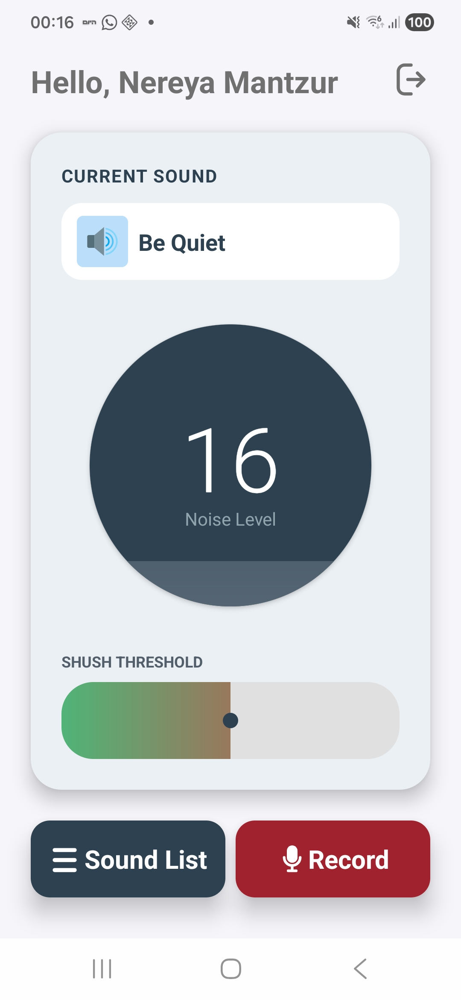
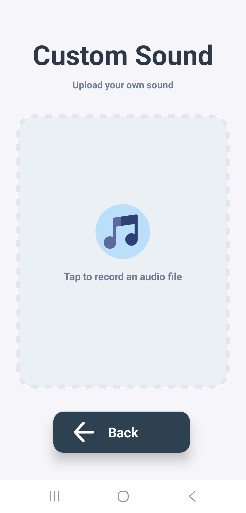
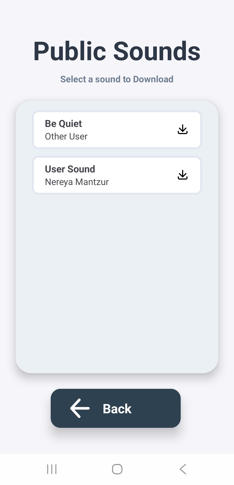
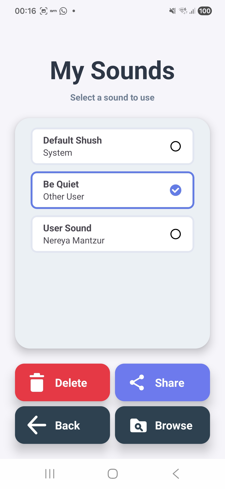

# ShushMe 🤫


**ShushMe** is a native Android application engineered in Kotlin that actively monitors ambient environmental noise levels and automatically triggers a customizable "shush" audio alert when a user-defined decibel threshold is breached. 

Designed with a focus on robust hardware resource management, the application bypasses high-level approximations in favor of low-level audio buffer processing. It features real-time audio sampling, concurrent background thread management, custom audio recording, and a cloud-synchronized community sound library powered by Firebase Cloud Storage.

---

## 🚀 Core Technical Architecture

The application is built on several complex subsystems that handle asynchronous data streams, hardware lifecycles, and remote network calls.

### 1. Low-Level Audio Buffer Processing
Instead of relying on `MediaRecorder`'s built-in amplitude estimations, ShushMe interfaces directly with the device's microphone hardware via the `AudioRecord` API. 

* **Hardware Configuration:** The audio stream is configured at a professional sample rate of 44,100 Hz, capturing a single mono channel using 16-bit PCM encoding (`AudioFormat.ENCODING_PCM_16BIT`). This ensures high fidelity and precise mathematical calculations.
* **Buffer Allocation:** The app uses `AudioRecord.getMinBufferSize()` to dynamically request the minimum memory footprint required by the Android OS to stream this data without dropping frames.
* **Blocking I/O & Threading:** Reading from the hardware buffer via `listener?.read()` is a blocking call. To prevent freezing the UI and triggering an Application Not Responding (ANR) crash, this read loop is strictly confined to a dedicated background `Thread`.
* **RMS Amplitude Calculation:** To calculate the actual "loudness" (power) of the environment, the background thread continuously reads audio chunks into a `ShortArray`. It computes the Root Mean Square (RMS) of these discrete samples:

$$RMS = \sqrt{\frac{1}{N} \sum_{i=0}^{N-1} buffer[i]^2}$$


### 2. Concurrency & Main Thread Synchronization
While the background thread continuously calculates RMS values, Android strictly prohibits updating UI elements from outside the Main UI Thread.

* **The Handler-Looper Paradigm:** `MainActivity` bridges this gap using a `Handler` tied to `Looper.getMainLooper()`. This attaches a message queue directly to the main thread's event loop.
* **Throttled Polling:** Instead of flooding the UI thread with render requests every time the audio buffer fills, the app utilizes a recursive `Runnable`. By calling `handler.postDelayed(this, 200)`, the app polls the latest amplitude every 200 milliseconds, ensuring the UI remains highly responsive without draining the battery.


### 3. Safe Media Lifecycle Management
The Android `MediaPlayer` relies on a fragile underlying C++ state machine; calling methods out of order results in an `IllegalStateException`.

* **The `SingleSoundPlayer` Wrapper:** ShushMe abstracts the media framework into a custom wrapper that strictly enforces state rules. The `release()` function safely stops and frees hardware decoder resources before any new audio track is prepared.
* **Synchronous vs. Asynchronous:** Local files utilize synchronous `prepare()` for instantaneous loading, while remote Firebase URLs utilize `prepareAsync()`. This offloads network buffering to OS background threads, firing an `setOnPreparedListener` callback only when the audio is safely loaded in memory.

### 4. Memory & State Management
* **Singleton Pattern:** The `DataManager` is declared as a Kotlin `object`, natively implementing the Singleton pattern. By caching `sounds` and `sharedSounds` in memory, the app avoids expensive, redundant disk I/O reads across Activity lifecycles.
* **String Parsing for State:** The app reconstructs its local state entirely from the filesystem during `loadFromFiles()`. By parsing the `.m4a` filenames (splitting by `_`), it dynamically rebuilds the `displayName` and `authorName` properties, eliminating the need for an internal SQLite/Room database just for metadata.

### 5. Multi-Mode UI Architecture
* **Stateful Adapters:** The `SoundAdapter` dynamically alters its view binding logic based on an `isSelectionMode` boolean. It functions as a local radio-button selection list in `MyListActivity`, but intelligently shifts into a remote download list in `SharedSoundsActivity` while reusing the exact same XML layouts and `RecyclerView`.
* **Callback Routing:** The adapter strictly manages views and delegates actual file system and Firebase operations back to the Activities via decoupled interfaces (`SoundSelectCallback`, `FirebaseStorageCallback`).

### 6. Cloud Infrastructure & Remote Synchronization


* **Storage Abstraction:** The `SharedSoundsActivity` maps remote Firebase `sounds/` directory metadata into localized `SoundItem` objects using the asynchronous `.listAll()` task.
* **Local Caching:** Selected community sounds are downloaded directly into the application's internal sandboxed `filesDir` using `.getFile()`, eliminating redundant network calls for subsequent playbacks.
* **Authenticated Uploads:** The `RecordActivity` verifies the user via `FirebaseAuth.getInstance()` and securely appends the user's display name to custom `.m4a` recordings before pushing them to the shared cloud bucket.

---

## 🧰 Tech Stack

* **Language:** Kotlin
* **UI Architecture:** ViewBinding, standard Android XML Layouts, `RecyclerView`
* **Hardware APIs:** `AudioRecord` (raw PCM buffer processing), `MediaRecorder` (AAC file recording), `MediaPlayer`
* **Backend & Cloud:** Firebase Authentication, Firebase Cloud Storage
* **Concurrency:** `java.lang.Thread`, Android `Handler(Looper.getMainLooper())`

---

## 📁 Project Structure Overview

* **`model/`**: Core data structures (`SoundItem.Builder`) and the `DataManager` state holder.
* **`adapters/`**: Custom `RecyclerView` implementations handling list logic and multi-mode view recycling.
* **`utils/`**: Hardware abstraction wrappers (`AudioManager`, `SingleSoundPlayer`).
* **`interfaces/`**: Strict contracts defining asynchronous event handling across module boundaries.

---

## ⚙️ Installation & Setup

To compile and run this project locally, you will need Android Studio and an active Firebase project.

1.  **Clone the repository:**
    ```bash
    git clone [https://github.com/NereyaHillel/ShushMe](https://github.com/NereyaHillel/ShushMe)
    ```
2.  **Open the project** in Android Studio.
3.  **Firebase Setup:**
    * Navigate to the [Firebase Console](https://console.firebase.google.com/) and create a new project.
    * Register a new Android App with the package name `com.dev.nereya.shushme`.
    * Download the `google-services.json` file and place it in the `app/` directory of your project.
    * Enable **Authentication** and **Cloud Storage** in your Firebase console. Ensure your Storage rules allow read/write access for authenticated users.
4.  **Permissions Check:** Ensure your physical device grants `Manifest.permission.RECORD_AUDIO` upon app launch. Emulators may not accurately simulate real-time microphone amplitude via `AudioRecord`.

## 📱 Screenshots
|                   Main Screen                   |                Recording Interface                |                   Community Sounds                   |                   User Sounds                   |
|:-----------------------------------------------:|:-------------------------------------------------:|:----------------------------------------------------:|:-----------------------------------------------:|
|  |  |  |  |

## 📝 License
This project is licensed under the MIT License - see the [LICENSE](LICENSE) file for details.
